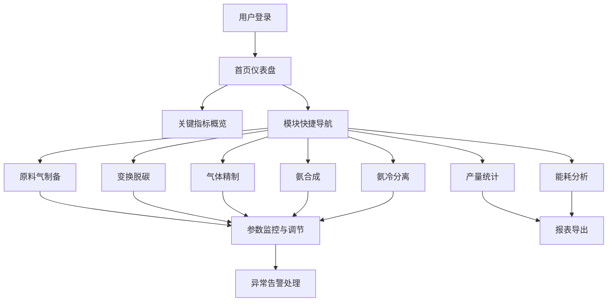

## 1. 产品概述

合成氨厂氨合成装置业务管理Web系统，面向合成氨车间生产管理人员，用于集中管理造气、净化、合成三大工段的生产过程监控与数据分析。系统覆盖原料气制备到氨合成全流程，提供实时数据监控、产量统计和能耗分析，助力工厂提升生产效率、降低能耗。

## 2. 核心功能

### 2.1 用户角色

| 角色 | 登录方式 | 核心权限 |
|------|---------|---------|
| 车间管理员 | 账号密码登录 | 查看全部模块数据、导出报表、配置参数 |
| 操作员 | 账号密码登录 | 查看实时监控数据、记录操作日志 |

### 2.2 功能模块

1. **首页仪表盘**：关键指标概览、实时告警、7大模块快捷入口
2. **原料气制备模块**：半水煤气制备流程监控与参数调节
3. **变换脱碳模块**：一氧化碳变换、变换气脱碳工艺监控
4. **气体精制模块**：铜洗精制工艺监控与气体成分分析
5. **氨合成模块**：合成塔温度控制、合成压力控制
6. **氨冷分离模块**：氨冷分离监控、液氨储罐液位管理、循环气放空、新鲜气补充
7. **产量统计模块**：合成氨产量实时与历史数据分析
8. **能耗分析模块**：吨氨能耗计算、多维度能耗分析

### 2.3 页面详情

| 页面名称 | 模块名称 | 功能描述 |
|---------|---------|---------|
| 首页仪表盘 | 总览面板 | 关键指标卡片（产量、能耗、压力、温度）、实时趋势图、模块快捷导航、告警信息 |
| 原料气制备 | 半水煤气制备 | 气化炉温度/压力监控、水煤气成分分析（H₂/CO/CO₂/N₂）、给煤量/蒸汽量调节、实时数据曲线 |
| 变换脱碳 | 一氧化碳变换 | 变换炉床层温度监控、CO转化率计算、蒸汽配比调节、变换气成分分析 |
| 变换脱碳 | 变换气脱碳 | 脱碳塔压力/液位监控、CO₂吸收率、溶液循环量、再生塔温度 |
| 气体精制 | 铜洗精制 | 铜洗塔压力/温度、铜液成分分析、微量CO/CO₂检测、铜液循环量 |
| 氨合成 | 合成塔温度 | 合成塔床层各点温度分布（轴向/径向）、热点温度追踪、温度超限告警 |
| 氨合成 | 合成压力控制 | 合成回路压力监控、压力调节阀状态、新鲜气补气压力、循环机出口压力 |
| 氨冷分离 | 氨冷分离 | 氨冷器温度/液位、气氨压力、液氨流量、分离效率 |
| 氨冷分离 | 液氨储罐 | 储罐液位实时监控、高低液位告警、液位趋势、储罐温度/压力 |
| 氨冷分离 | 气体管理 | 循环气放空量、新鲜气补充量、氢氮比调节、惰性气体含量 |
| 产量统计 | 合成氨产量 | 班产/日产/月产统计、产量趋势图、产量目标达成率、历史对比分析 |
| 能耗分析 | 吨氨能耗 | 吨氨综合能耗、分项能耗（煤/电/蒸汽/水）、能耗趋势、能耗对比分析 |

## 3. 核心流程

### 3.1 生产监控流程
用户登录系统后，通过首页仪表盘查看关键生产指标概览，根据需要进入各业务模块查看详细工艺参数，对异常参数进行告警处理，定期查看产量统计与能耗分析报告，指导生产优化。

## 4. 用户界面设计

### 4.1 设计风格
- **主色调**：工业蓝 (#1e3a5f) 为基础色，搭配科技感青色 (#00d4aa) 作为强调色，告警色 (#ff4757)，安全色 (#2ed573)
- **辅助色**：深灰背景 (#0f1923)，卡片深灰 (#1a2733)，文字浅灰 (#e8eaed)
- **按钮风格**：扁平化设计，轻微圆角（4px），hover时有细微发光效果
- **字体**：标题使用工业感字体（Orbitron/等宽类），正文使用清晰易读的无衬线字体
- **布局风格**：侧边导航栏 + 顶部状态栏 + 主内容区卡片式布局
- **图标风格**：线性工业风格图标，简洁精准
- **整体氛围**：工业科技感、专业严谨、深色主题（适合控制室长时间使用）

### 4.2 页面设计概览

| 页面名称 | 模块名称 | UI元素 |
|---------|---------|---------|
| 首页仪表盘 | 总览面板 | 数据卡片网格、实时折线图、环形进度图、告警列表、模块导航卡 |
| 原料气制备 | 半水煤气制备 | 工艺流程图（带实时数据标注）、参数监控面板、趋势折线图、控制调节滑块 |
| 变换脱碳 | 变换/脱碳 | 双塔流程图、温度分布热力图、成分比例饼图、操作面板 |
| 气体精制 | 铜洗精制 | 精制流程图、微量气体检测仪表盘、铜液参数表、趋势曲线 |
| 氨合成 | 温度/压力 | 合成塔温度分布柱状图、压力监控仪表盘、PID控制参数面板、告警提示 |
| 氨冷分离 | 分离/储罐/气体 | 储罐液位动画、流量实时监控、阀门状态指示、气体成分分析 |
| 产量统计 | 产量分析 | 产量柱状图、趋势折线图、目标进度条、数据表格、时间筛选器 |
| 能耗分析 | 能耗分析 | 能耗堆叠面积图、分项能耗饼图、对标分析图、能耗排名表 |

### 4.3 响应式设计
- **桌面优先**：面向控制室大屏显示器（1920×1080及以上）设计，信息密度高
- **平板适配**：侧边栏可折叠，卡片自动换行
- **移动端**：简化展示核心指标，隐藏复杂图表，提供基础数据浏览
