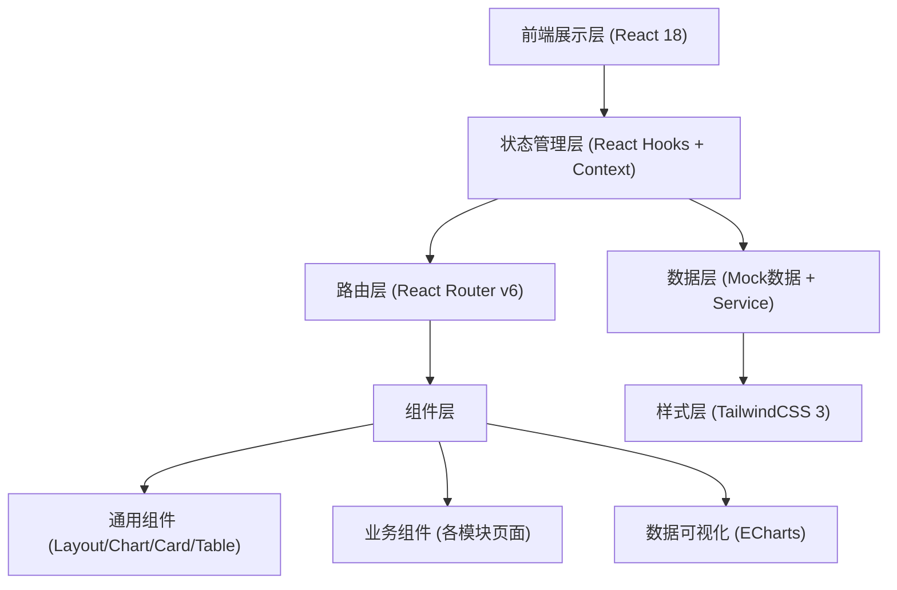
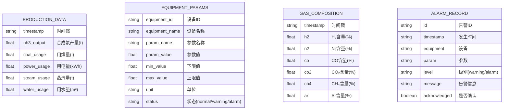

## 1. 架构设计



## 2. 技术说明

- **前端框架**：React@18 + TypeScript + Vite
- **路由管理**：React Router v6
- **样式方案**：TailwindCSS 3 + CSS Variables（主题定制）
- **图表库**：ECharts 5（工业级图表，支持复杂监控曲线、仪表盘、热力图等）
- **图标库**：Lucide React（简洁线性工业风格图标）
- **状态管理**：React Context + useReducer（轻量级状态管理）
- **初始化工具**：Vite（快速构建工具）
- **后端**：无后端，使用本地Mock数据模拟实时数据
- **数据模拟**：setInterval模拟实时数据更新，静态JSON模拟历史数据

## 3. 路由定义

| 路由 | 用途 |
|------|------|
| / | 首页仪表盘（Dashboard） |
| /raw-gas | 原料气制备模块（半水煤气制备） |
| /shift-decarb | 变换脱碳模块（CO变换 + 脱碳） |
| /refining | 气体精制模块（铜洗精制） |
| /synthesis | 氨合成模块（温度/压力控制） |
| /separation | 氨冷分离模块（分离/储罐/气体管理） |
| /production | 产量统计模块 |
| /energy | 能耗分析模块 |

## 4. 数据模型

### 4.1 数据模型定义



### 4.2 核心数据类型

```typescript
// 实时监控参数
interface MonitorParam {
  id: string;
  name: string;
  value: number;
  unit: string;
  min: number;
  max: number;
  status: 'normal' | 'warning' | 'alarm';
  trend: 'up' | 'down' | 'stable';
}

// 产量记录
interface ProductionRecord {
  date: string;
  shift: '早班' | '中班' | '晚班';
  output: number;
  target: number;
}

// 能耗记录
interface EnergyRecord {
  date: string;
  coal: number;      // 吨煤/吨氨
  power: number;     // kWh/吨氨
  steam: number;     // 吨蒸汽/吨氨
  water: number;     // m³/吨氨
  total: number;     // 综合能耗 GJ/吨氨
}

// 气体成分
interface GasComposition {
  h2: number;
  n2: number;
  co: number;
  co2: number;
  ch4?: number;
  ar?: number;
}

// 告警信息
interface AlarmRecord {
  id: string;
  time: string;
  level: 'warning' | 'alarm';
  equipment: string;
  message: string;
  acknowledged: boolean;
}
```

## 5. 项目目录结构

```
src/
├── assets/              # 静态资源
│   └── styles/          # 全局样式、CSS变量
├── components/          # 通用组件
│   ├── layout/          # 布局组件（Sidebar/Header/Layout）
│   ├── charts/          # 图表封装组件
│   ├── ui/              # UI基础组件（Card/Button/Table等）
│   └── process/         # 工艺流程图组件
├── pages/               # 页面组件
│   ├── Dashboard/       # 首页仪表盘
│   ├── RawGas/          # 原料气制备
│   ├── ShiftDecarb/     # 变换脱碳
│   ├── Refining/        # 气体精制
│   ├── Synthesis/       # 氨合成
│   ├── Separation/      # 氨冷分离
│   ├── Production/      # 产量统计
│   └── Energy/          # 能耗分析
├── data/                # Mock数据
│   ├── mockData.ts      # 模拟数据
│   └── hooks.ts         # 数据更新Hook
├── types/               # TypeScript类型定义
│   └── index.ts
├── context/             # React Context
│   └── AppContext.tsx
├── utils/               # 工具函数
│   └── helpers.ts
├── App.tsx              # 根组件
├── main.tsx             # 入口文件
└── index.css            # 全局样式
```
